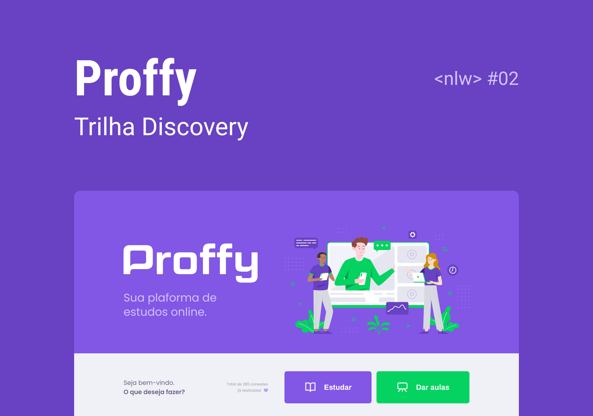

<p align="center">
   
</p>

<p align="center">
  <a href="https://www.linkedin.com/in/alexsandrobezerra/">
    
  </a>
  
  
  
</p>

> :rocket: Projeto feito para conectar professores e estudantes, feito na Next Level Week #2 @Rocketseat

<p align="center">
   
</p>

# Índice
<p align="center">
  <a href="#sobre">Sobre</a>&nbsp;&nbsp;&nbsp;|&nbsp;&nbsp;&nbsp;
  <a href="#tecnologias">Tecnologias</a>&nbsp;&nbsp;&nbsp;|&nbsp;&nbsp;&nbsp;
  <a href="#como-rodar">Como Rodar</a>&nbsp;&nbsp;&nbsp;|&nbsp;&nbsp;&nbsp;
  <a href="#como-contribuir">Como Contribuir</a>&nbsp;&nbsp;&nbsp;|&nbsp;&nbsp;&nbsp;
  <a href="#licenca">Licença</a>
</p>

## Web screenshots
<div style="display: flex; flex-direction: 'row'; align-items: 'center';">
   
   
</div>

## Mobile screenshots
<div style="display: flex; flex-direction: 'row';">
   
   
   
   
</div>

<p id="sobre"></p>

## 📖 Sobre

Este é um projeto desenvolvido durante a **[Next Level Week](https://nextlevelweek.com/)**, realizada pela **[@Rocketseat](https://github.com/Rocketseat)** durante os dias 3 a 9 de Agosto de 2020.

A proposta do projeto é uma aplicação que possa ligar quem deseja aprender, com quer ensinar. É possível encontrar alunos para o que você leciona, ou encontrar o professor para aquela matéria que você sempre quis aprender mais! Sem que haja nenhuma limitação de área!!

<p id="tecnologias"></p>

# :computer: Tecnologias
Esse projeto foi feito utilizando as seguintes tecnologias:

* [Typescript](https://www.typescriptlang.org/)
* [Express](https://expressjs.com/)
* [React](https://reactjs.org/)
* [Expo](https://expo.io/)

<p id="como-rodar"></p>

# :construction_worker: Como rodar
```bash
# Clone o Repositoria
$ git clone https://github.com/Alexsrh/nlw-02.git
```
### 📦 Rode a API

```bash
# Vá para a pasta do servidor
$ cd nlw-02/server

# Instale as depedencias
$ yarn install

# Rode a aplicação
$ yarn start
```
Acesse a API: http://localhost:3333/

### 💻 Rode o Project Web

```bash
# Vá para a pasta web
$ cd nlw-02/web

# Instale as depedencias
$ yarn install

# Rode a aplicação
$ yarn start
```
Acesse: http://localhost:3000/ para ver o resultado.

### 📱 Run Mobile Project
Para rodar o projeto mobile você precisa de um celular com o [expo](https://play.google.com/store/apps/details?id=host.exp.exponent) instlado ou um emulador android/ios.

```bash
# Vá para a pasta mobile
$ cd nlw-02/mobile

# Instale as depedencias
$ yarn install

# Rode a aplicação
$ yarn start
```
Depois leia o QRCode com o app do [expo](https://play.google.com/store/apps/details?id=host.exp.exponent) ou rode em um emulador.

<p id="como-contribuir"></p>

## Como contribuir

- Faça um Fork desse repositório,
- Crie uma branch com a sua feature: `git checkout -b my-feature`
- Commit suas mudanças: `git commit -m 'feat: My new feature'`
- Push a sua branch: `git push origin my-feature`

<p id="licenca"></p>

# :closed_book: Licença

Feito com amor por [Alexsandro G Bezerra](https://github.com/Alexsrh) 🚀.
Esse projeto esta sobre [MIT license](./LICENSE).


Dê uma ⭐️ se esse projeto te ajudou!
